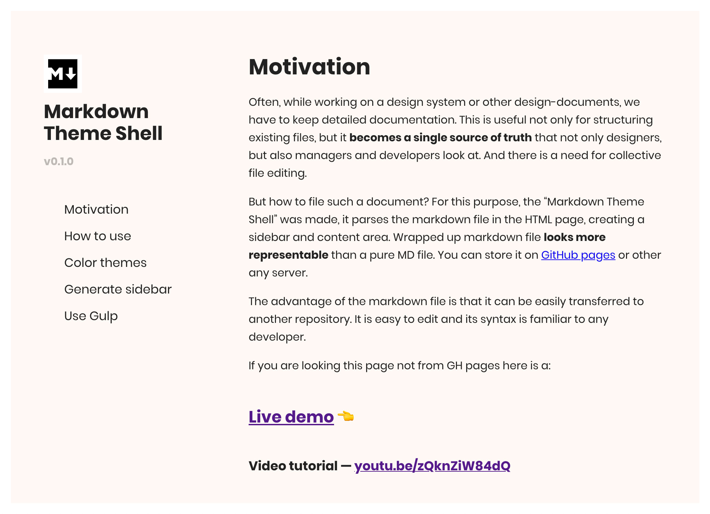

# Markdown Theme Shell

## v0.1.0

## Motivation

Often, while working on a design system or other design-documents, we have to keep detailed documentation. This is useful not only for structuring existing files, but it **becomes a single source of truth** that not only designers, but also managers and developers look at. And there is a need for collective file editing.

But how to file such a document? For this purpose, the “Markdown Theme Shell” was made, it parses the markdown file in the HTML page, creating a sidebar and content area. Wrapped up markdown file **looks more representable** than a pure MD file. You can store it on [GitHub pages](https://pages.github.com/) or other any server.

The advantage of the markdown file is that it can be easily transferred to another repository. It is easy to edit and its syntax is familiar to any developer.

If you are looking this page not from GH pages here is a:

## [Live demo and documentation](https://pavellaptev.github.io/markdown-theme-shell/public/) 👈

### Video tutorial — [youtu.be/zQknZiW84dQ](https://youtu.be/zQknZiW84dQ)

---

### Authors

Code: [Pavel Laptev](http://laptevpavel.ru)
Design: [Alexander Artsvuni](http://artsvuni.com)

### License

[MIT](https://github.com/markdown-it/markdown-it/blob/master/LICENSE)
