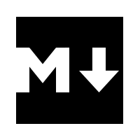
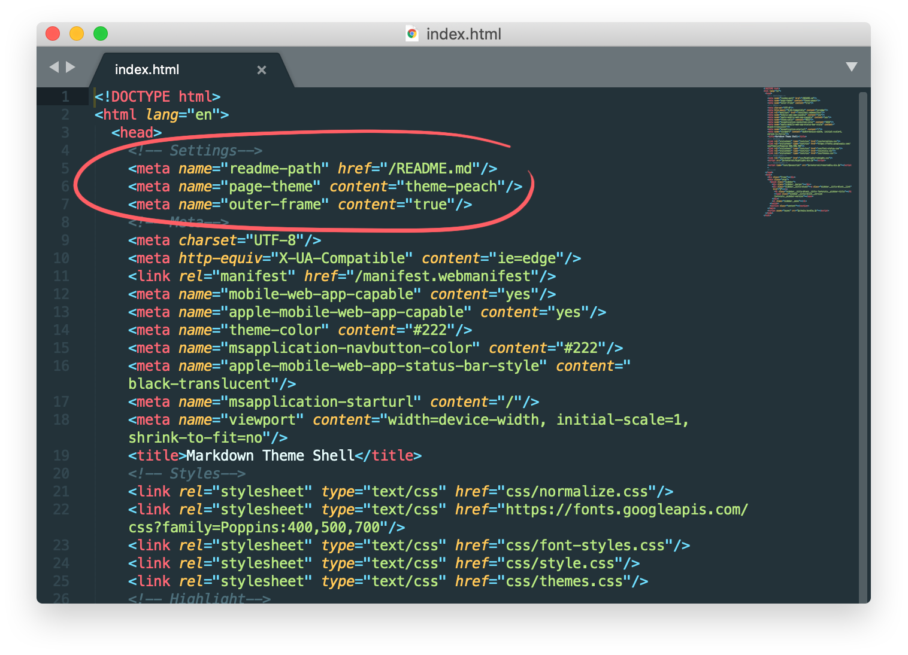
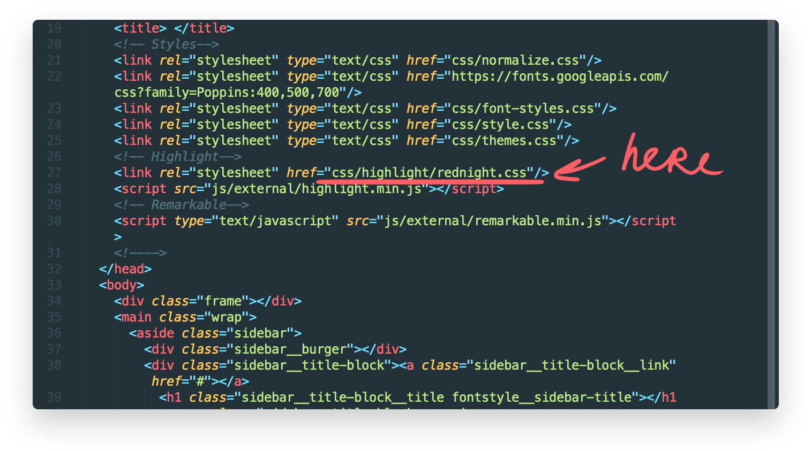
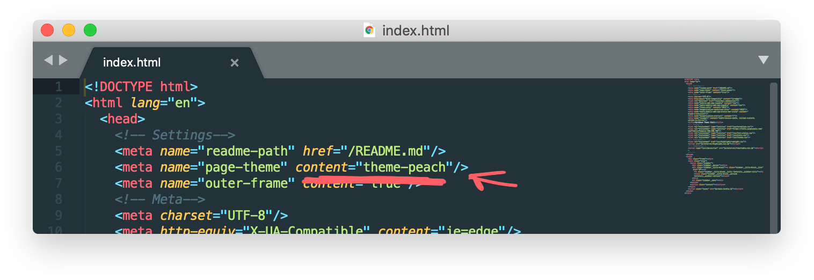

 [](logo-id)

# Markdown Theme Shell [](title-id)

## v0.1.0 [](version-id)

### Table of contents [](toc-id)

- [Motivation](#Motivation)
  - [Advantages of use](#Advantages-of-use)
- [How to use](#How-to-use)
  - [Settings](#Settings)
  - [Highlight your code](#Highlight-your-code)
  - [Change fonts](#Change-fonts)
  - [Change favicon](#Change-favicon)
  - [Multiple templates](#Multiple-templates)
- [Color themes](#Color-themes)
- [Generate sidebar](#Generate-sidebar)
  - [Logo](#Logo)
  - [Page and doc title](#Page-and-document-title)
  - [Doc version](#Doc-version)
  - [Table of Contents](#Table-of-Contents)
    - [Nested levels](#Nested-levels)
- [Use Gulp](#Use-Gulp)

# Motivation

Often, while working on a design system or other design-documents, we have to keep detailed documentation. This is useful not only for structuring existing files, but it **becomes a single source of truth** that not only designers, but also managers and developers look at. And there is a need for collective file editing.

But how to file such a document? For this purpose, the “Markdown Theme Shell” was made, it parses the markdown file in the HTML page, creating a sidebar and content area. Wrapped up markdown file **looks more representable** than a pure MD file. You can store it on [GitHub pages](https://pages.github.com/) or other any server.

The advantage of the markdown file is that it can be easily transferred to another repository. It is easy to edit and its syntax is familiar to any developer.

### Video tutorial — [youtu.be/zQknZiW84dQ](https://youtu.be/zQknZiW84dQ)

### Github Project — [github.com/PavelLaptev/markdown-theme-shell](https://github.com/PavelLaptev/markdown-theme-shell)

---

## Advantages of use

- Adgustable design
- Color themes
- Easy to use. No code knoledge required
- Table of contents as a sidebar menu
- Got simple mobile version
- Supports <span style="color: #f45">html tags and styles</span>

---

# How to use

Copy ["public" folder](https://github.com/PavelLaptev/markdown-theme-shell/tree/master/public) from repository, rename it if you want and replace `README.md` file with your file. You can also use multiple `*.md` files. For each `*.md` file you will also need to have `*.html` file.

### Use local server for preview

"Theme Shell" use `fetch method` to get the content from `*.md` file that's why you need to launch the page on a local server if you want to see result before you move it on an actual server. There are several ways two make it:

1. Download [Prepros App](https://prepros.io/). Drag-n-drop "public" folder into the app.
2. Running a simple Python's `SimpleHTTPServer`. See [instruction](https://developer.mozilla.org/en-US/docs/Learn/Common_questions/set_up_a_local_testing_server)

---

## Settings

You can find page settings if you open html page. Settings is a set of meta-tags on the top of the page.



So far you can adjust:

| Settings      | Type    | Description                                                                                    |
| :------------ | :------ | :--------------------------------------------------------------------------------------------- |
| `readme-path` | string  | is the path to `*.md` file. You can set any name and path to your file here                    |
| `page-theme`  | string  | here you can change a color theme. All color themes placed inside css folder `themes.css` file |
| `outer-frame` | boolean | switching off/on (`true` or `false`) white frame around the page                               |

Available themes — `theme-peach` (default), `theme-minimal`, `theme-material`, `theme-rednight`

---

## Highlight your code

We are using [highlight.js](https://highlightjs.org/) for code snippets. If you want to change the theme, then just change the name of theme. All themes stored in the `public/css/highlight` folder.



Avalible themes:

- `peach`
- `rednight`
- `minimal`
- `material`

---

## Change fonts

We use [Google Fonts](https://fonts.google.com/). They connect at the top of the page.

```html
<link
  rel="stylesheet"
  type="text/css"
  href="https://fonts.googleapis.com/css?family=Poppins:400,500,700"
/>
```

To change the font family and font styles, open CSS file `font-styles`.

```css
body {
  font-family: "Poppins", sans-serif;
}

.fontstyle__sidebar-title {
  font-weight: 700;
  font-size: 28px;
}
.fontstyle__sidebar-version {
  font-size: 16px;
  font-weight: 700;
}
.fontstyle__sidebar-first-level-title {
  font-weight: 400;
  font-size: 18px;
}
.fontstyle__sidebar-second-level-title {
  font-weight: 400;
  font-size: 16px;
}
.fontstyle__sidebar-third-level-title {
  font-weight: 400;
  font-size: 15px;
}
```

Other styles you can find inside `style.css`

---

## Change favicon

All icons store are stored in "favicon" folder. To generate your own icons you can use [realfavicongenerator.net](https://realfavicongenerator.net/)

```html
<!-- Favicon -->
<link
  rel="apple-touch-icon"
  sizes="180x180"
  href="/favicon/apple-touch-icon.png"
/>
<link
  rel="icon"
  type="image/png"
  sizes="32x32"
  href="/favicon/favicon-32x32.png"
/>
<link
  rel="icon"
  type="image/png"
  sizes="16x16"
  href="/favicon/favicon-16x16.png"
/>
<link rel="manifest" href="/favicon/manifest.webmanifest" />
<meta name="msapplication-TileColor" content="#da532c" />
<meta name="theme-color" content="#fff" />
```

---

## Multiple templates

You alse can use multiple pages in one project — just copy/paste the main file `index.html` and rename it. new README file you could store inside the root or folder or create new `readme` folder e.g.

---

# Color themes

You can change a theme by using meta-tag `page-theme` on the top of the html file.

Avalible themes:

- `theme-peach` — light theme. Current theme
- `theme-minimal` — light theme → [demo](../themes-examples/minimal.html)
- `theme-rednight` — dark theme → [demo](../themes-examples/rednight.html)
- `theme-material` — dark theme → [demo](../themes-examples/material.html)



Or you can create your own theme.

Theme Shell use [CCS variables](https://developer.mozilla.org/en-US/docs/Web/CSS/Using_CSS_variables) across the document, so all colors can be easily changed. Look at the example below:

```css
.theme-peach {
  --black-clr: #222;
  --text-clr: var(--black-clr);
  --text-clr-opacity-medium: rgba(34, 34, 34, 0.6);
  --text-clr-opacity-high: rgba(34, 34, 34, 0.4);
  --selection-clr: #ffc3c3;
  --primary-clr: #fff9f5;
  --accent-clr: #f57;
  --accent-clr-opacity-medium: rgba(255, 85, 119, 0.4);
  --sidebar-visible: #fff;
  --sidebar-burger-background: #fff;
  --sidebar-burger-opened-background: var(--primary-clr);
  --standart-link: #00e;
  --visited-link: #551a8b;
  --hovered-link: var(--accent-clr);
}
```

To make your own theme all you need is just copy the hole theme block, change the name and colors.

---

# Generate sidebar

To generate the sidebar and page title we use empty links that will not be visible on the github or in another parser. These are the beacons to which the script is oriented when generating the page.

## Logo

```md
 [](logo-id)
```

Or just keep it empty [](version-id) or delete it.

## Page and document title

```md
# Markdown Theme Shell [](title-id)
```

## Doc version

```md
## v0.1.0 [](version-id)
```

Or just keep it empty [](version-id) or delete it.

## Table of Contents

```md
### Table of contents [](toc-id)

- [Motivation](#Motivation)
  - [Advantages of use](#Advantages-of-use)
- [How to use](#How-to-use)
```

### Nested levels

Sidebar supports only 3 nested levels 👆

---

# Use Gulp

For advanced users. If you familiar with CSS and a little bit with JS you can make your customization process faster.

### Clone repository

Clone this repository using [GitHub Desktop](https://desktop.github.com/) or [Terminal](https://help.github.com/articles/cloning-a-repository/).

### Install Gulp

We are using [Gulp](https://gulpjs.com/) to manage and process files. If you don't have installed Gulp, then install it using this instruction — [gulpjs.com/docs/en/getting-started/quick-start](https://gulpjs.com/docs/en/getting-started/quick-start)

### Install dependecies

```
$ npm i
```

### Run Gulp

```
$ gulp
```

### Enjoy 🎉

Change whatever you want. We are using ES6, [Stylus](http://stylus-lang.com/) for CSS and [Pug](https://pugjs.org/) for html files. Gulp file already has Browser-sync and Webpack pipes for ES6 code.

App structure:

```
App folder
├── scripts
│   ├── parser-utils
|   |   └── ...
│   ├── utils
|   |   └── ...
│   ├── main.js
│   ├── parser.js
│   └── sidebar-actions.js
├── styl
│   ├── components
|   |   └── ...
│   ├── helpers
|   |   └── ...
│   ├── themes
|   |   └── ...
│   ├── font-styles.styl
│   └── style.styl
└── index.pug

```

---

# Credits

### Authors

Code: [Pavel Laptev](http://laptevpavel.ru)
Design: [Alexander Artsvuni](http://artsvuni.com)

### License

[MIT](https://github.com/markdown-it/markdown-it/blob/master/LICENSE)
